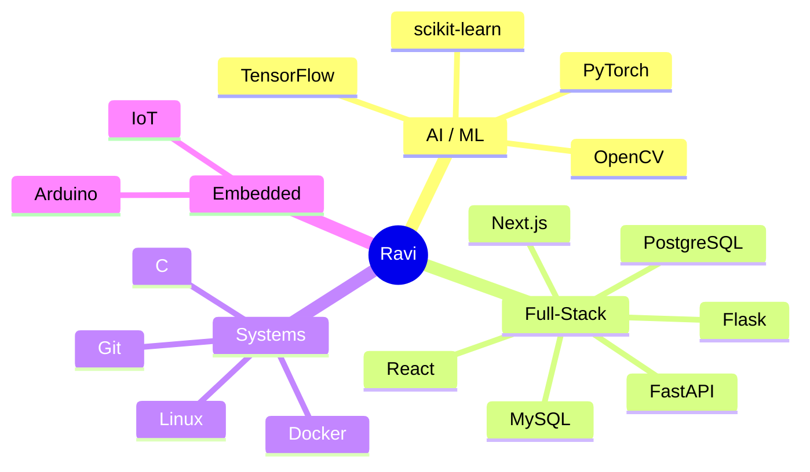
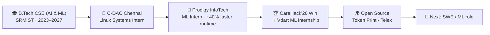

<!-- ===================== HEADER ===================== -->


<p align="center">
  
</p>

<p align="center">
  <a href="mailto:ravishankarx2005@gmail.com"></a>
  <a href="https://www.linkedin.com/in/ravi-shankar-b-77b5b9377/"></a>
  <a href="https://github.com/shanky-ux"></a>
  <a href="https://leetcode.com/ravishankar07/"></a>
  <a href="https://ravish4nkar.vercel.app"></a>
</p>

<p align="center">
  
  
  
</p>

---

## 🧬 `~/about.py`

```python
class RaviShankar:
    role      = "ML Engineer · Full-Stack · AI Systems"
    education = "B.Tech CSE (AI & ML) @ SRMIST · 2027"
    base      = "Chennai, India"

    currently = [
        "shipping Applivo — SaaS opportunity-orchestration platform",
        "going deeper into LLMs & multimodal AI",
        "contributing to open source: Token Print · Telex",
    ]

    wins = [
        "Amazon ML Challenge '24 — Top 1% (Rank 62 / 6,223)",
        "CareHack'26 — 1st place · ₹30,000 + Vdart internship",
        "YUVA National Hackathon — Winner (Hardware)",
        "IEEE paper — IoT backpack load alert system",
    ]

    open_to = ["SWE / ML internships", "hackathon teams", "OSS collabs"]
```

---

## 🌍 Open Source — Latest Contributions

<p align="center">
  <a href="https://github.com/search?q=author%3Ashanky-ux+type%3Apr+is%3Amerged&type=pullrequests"></a>
</p>

<table width="100%">
<tr>
<td width="50%" valign="top">

### 🪙 Token Print


**Latest contribution:** `EDIT: one line on what you changed / fixed / built`

[PR #EDIT](https://github.com/EDIT-OWNER/EDIT-REPO/pull/EDIT) · `merged`

<a href="https://github.com/EDIT-OWNER/EDIT-REPO">
  
</a>

</td>
<td width="50%" valign="top">

### 📡 Telex


**Latest contribution:** `EDIT: one line on what you changed / fixed / built`

[PR #EDIT](https://github.com/EDIT-OWNER/EDIT-REPO/pull/EDIT) · `merged`

<a href="https://github.com/EDIT-OWNER/EDIT-REPO">
  
</a>

</td>
</tr>
</table>

---

## 🛰️ Tech Universe



<table width="100%" align="center">
<tr>
<td align="center" width="25%">
<b>Languages & Systems</b><br><br>

</td>
<td align="center" width="25%">
<b>AI / ML</b><br><br>

</td>
<td align="center" width="25%">
<b>Full-Stack</b><br><br>

</td>
<td align="center" width="25%">
<b>Infra & Embedded</b><br><br>

</td>
</tr>
</table>

---

## 📡 Mission Control

<p align="center">
  
  
</p>

<p align="center">
  
</p>

<p align="center">
  
  
</p>

<p align="center">
  
</p>

<p align="center">
  
</p>

<p align="center">
  
</p>

---

## 🏆 Hall of Fame

| | Event | Domain | Result |
|:-:|-------|--------|--------|
| 🥇 | **CareHack'26** | AI / ML | 1st Place — ₹30,000 + Internship @ Vdart |
| 🥇 | **YUVA National Hackathon** | Hardware | Winner — ₹5,000 |
| 🏅 | **Amazon ML Challenge 2024** | Machine Learning | Top 1% — Rank 62 / 6,223 |
| 🏆 | **DigiGreen Hackathon** | AI / ML | 4th Place |
| 📄 | **IEEE Publication** | IoT / Embedded | Co-authored — Backpack Load Alert System |
| 🤝 | **Community Connect** | NGO Application | Successfully Deployed |
| ✅ | **HackerRank Python** | Programming | Certified |

---

## 🚀 Mission Log — Projects

| Status | Project | What it does | Stack |
|:------:|---------|--------------|-------|
| 🟢 | **[Applivo](https://applivo.in)** | SaaS platform to discover opportunities & automate applications — self-hosted on an Oracle Cloud ARM VM | `FastAPI` `Next.js` `Docker Compose` |
| 🟢 | **[OrbitXOS](https://orbitxos-5b09.onrender.com)** | Space-inspired interactive dashboard with backend AI | `React` `Vite` `Tailwind` |
| 🟢 | **[DigiVerify AI](https://digiverify-ai-6.onrender.com)** | AI-powered digital verification & fraud detection | `Python` `Flask` |
| 🟢 | **[Skin Disease Classifier](https://skinscanai.vercel.app/)** | Computer-vision skin disease classification | `PyTorch` `FastAPI` `Next.js` |
| 🟢 | **[Student Performance Predictor](https://predicting-student-performance-with.onrender.com)** | ML model predicting academic performance | `Python` `scikit-learn` |
| 🔵 | **[Customer Churn Batch Prediction](https://github.com/shanky-ux/Customer_Churn_BatchPrediction)** | Batch churn prediction system | `JavaScript` |
| 🔵 | **[NGO Old-Age Home App](https://github.com/shanky-ux/Ngo-Oldage-Home-Management-App)** | Old-age home administration app | `TypeScript` |
| 🟢 | **[Portfolio](https://ravish4nkar.vercel.app/)** | Dark space-tech aesthetic, glassmorphism | `Next.js` `Tailwind` |

<p align="center">
  <a href="https://github.com/shanky-ux?tab=repositories"></a>
</p>

---

## 💼 Career Trajectory



**CGPA 8.32 / 10** · Pre-final year · Graduating 2027

---

## 🧩 LeetCode

<p align="center">
  
</p>

---

## 📬 Open Channel

<p align="center">
  Building something with ML, full-stack or hardware? Let's talk.<br><br>
  <a href="mailto:ravishankarx2005@gmail.com"></a>
  <a href="https://www.linkedin.com/in/ravi-shankar-b-77b5b9377/"></a>
</p>


